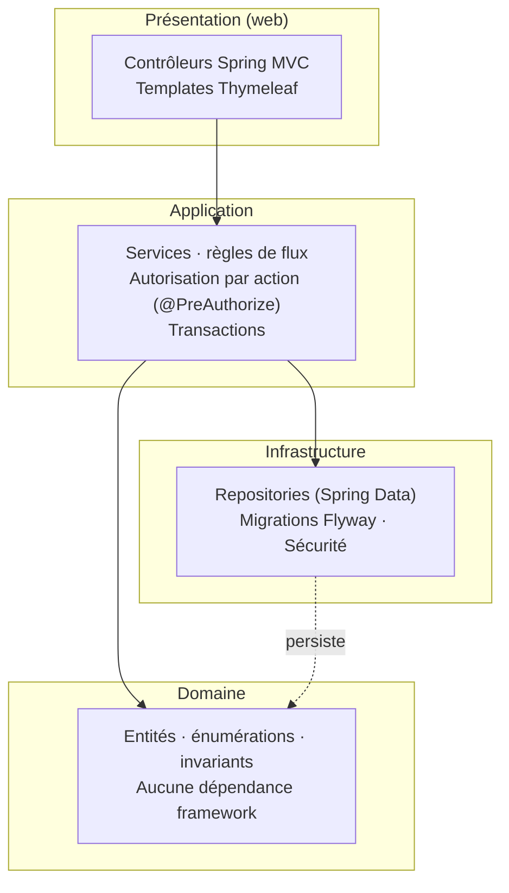
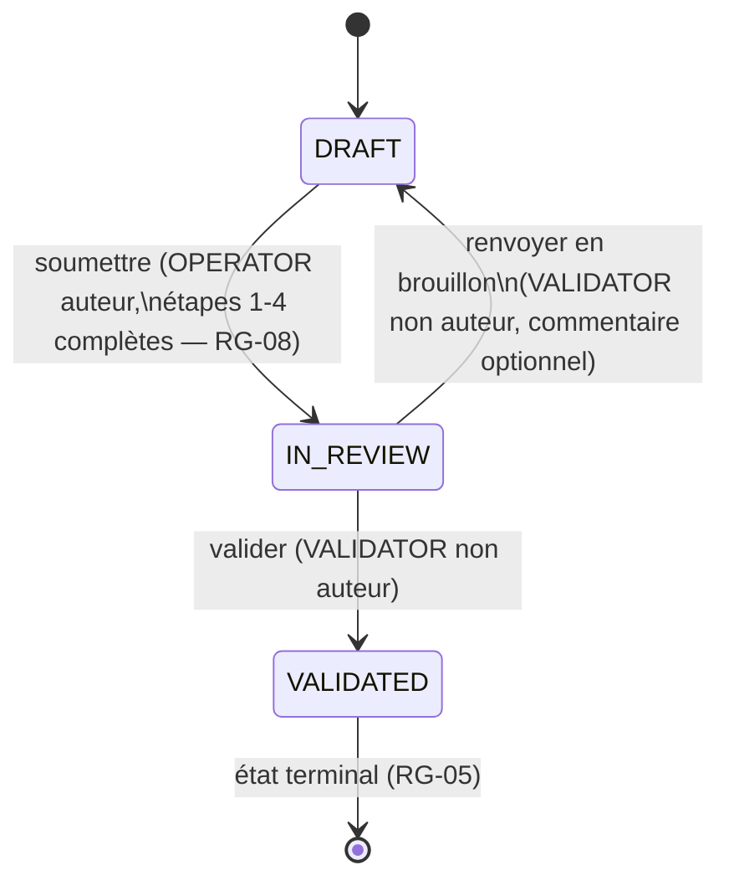

# Dossier Technique — DataCom

### Réécriture et sécurisation d'une application monolithique

**Séminaire :** Réécriture & sécurisation d'une application monolithique
**Auteurs :** Sam LECLERCQ · Hector ROUSSEL
**Dépôt :** [github.com/Ryujin42/datacom](https://github.com/Ryujin42/datacom)
**Date :** 30/07/2026 · **Version du logiciel :** 0.1.0-SNAPSHOT — six lots (L0→L6) mergés dans `main`
**Livrables du séminaire :** ce dossier technique · le code applicatif et son dépôt Git · une présentation orale

---

> **Note de lecture.** Ce document ne cherche pas à décrire *ce qui a été fait* mais à **justifier pourquoi**, à chaque étape, un choix a été préféré à ses alternatives. Chaque affirmation s'appuie sur une preuve vérifiable dans le dépôt : un identifiant de règle (`RG-xx`, `SEC-xx`, `ECO-xx`, `TEC-xx`), un fichier, un test, ou un chiffre mesuré — jamais une formulation générique. L'audit du legacy (`Analyse/AUDIT.md`), les spécifications de la refonte (`Datacom/SPECIFICATIONS.md` v2.2) et l'historique Git réel du dépôt `datacom-refonte` en sont les sources primaires.

## Table des matières

1. [Introduction et contexte](#1-introduction-et-contexte)
2. [Audit de l'existant](#2-audit-de-lexistant)
3. [Stratégie de refonte retenue et alternatives écartées](#3-stratégie-de-refonte-retenue-et-alternatives-écartées)
4. [Architecture cible](#4-architecture-cible)
5. [Sécurité](#5-sécurité)
6. [Qualité et tests](#6-qualité-et-tests)
7. [Écoconception](#7-écoconception)
8. [Organisation du travail](#8-organisation-du-travail)
9. [Bilan et limites assumées](#9-bilan-et-limites-assumées)
10. [Annexes](#10-annexes)

---

## 1. Introduction et contexte

### 1.1 Le produit

DataCom est l'outil interne par lequel une organisation **enregistre les fiches de ses produits, en contrôle la conformité, puis autorise leur mise en circulation sur le marché**. La fiche produit est le dossier de référence ; l'acte de validation engage l'organisation vis-à-vis de la réglementation. Deux populations l'utilisent, dont la séparation des responsabilités est la raison d'être du logiciel :

- l'**opérateur de saisie**, qui constitue les dossiers en quatre étapes (identification, classification, traçabilité, récapitulatif) ;
- le **responsable conformité**, qui contrôle les fiches soumises, les valide ou les renvoie en correction.

Que cette séparation soit **garantie par le système et non par la discipline des utilisateurs** est l'exigence centrale du projet (`SPECIFICATIONS.md` §2.1) — et, comme le montre le §2, c'est précisément ce que le logiciel existant ne fait pas.

### 1.2 Le problème métier hérité

L'application legacy (servlets/JSP, Java 11, ~2 500 lignes, `SeminaireDatacom/Datacom/`) est fonctionnelle dans ses grandes lignes mais **n'assure aucune des garanties pour lesquelles elle existe** : n'importe quel utilisateur authentifié peut valider n'importe quelle fiche, y compris la sienne. Le §2 en détaille les causes précises.

### 1.3 Démarche

Le projet suit la démarche imposée par le séminaire : **audit** du code existant (dette technique, vulnérabilités, defects fonctionnels), **spécification** de la refonte arbitrant les choix ambigus (`SPECIFICATIONS.md` §0), **découpage en lots** livrables et démontrables (§11), puis **exécution** lot par lot avec preuve automatisée à chaque étape (tests, CI, mesures). Les sections suivantes suivent cet ordre et citent, pour chaque affirmation, sa source dans le dépôt.

---

## 2. Audit de l'existant

*Synthèse argumentée de `Analyse/AUDIT.md` — le document complet (696 lignes) reste la référence pour le détail ligne par ligne.*

### 2.1 Verdict et trois constats structurants

L'audit conclut : **l'application est fonctionnellement incomplète et n'est pas déployable en production en l'état** (`AUDIT.md` §1). Trois constats en découlent, par ordre d'impact :

1. **La sécurité est absente, pas seulement faible.** Injection SQL sur 100 % des requêtes, mots de passe en clair, et surtout **aucun contrôle d'autorisation** — la règle métier que l'application existe pour faire respecter n'est nulle part implémentée dans le code.
2. **Il n'y a pas d'architecture.** Aucune couche service ni d'accès aux données : le SQL est concaténé dans les servlets, un `ResultSet` JDBC ouvert est transmis à la JSP qui l'itère elle-même, la logique de workflow est répartie entre servlet et 1 026 lignes de scriptlets. Aucun test.
3. **La dette est concentrée et le volume est faible.** ~800 lignes de Java, ~1 350 de JSP. Une réécriture complète est plus rapide et moins risquée qu'une remise à niveau incrémentale — argument développé au §3.

### 2.2 Vulnérabilités — vue d'ensemble

| Gravité | Nombre | Exemples |
|---|---:|---|
| **Critique** | 6 | Injection SQL généralisée, contournement d'authentification, absence totale de RBAC, mots de passe en clair |
| **Élevée** | 7 | XSS stocké, CSRF, fixation de session, IDOR, contournement du workflow |
| **Moyenne** | 8 | Fuite d'informations, secrets en dur, absence d'audit, pas d'en-têtes de sécurité |
| **Faible** | 5 | Absence de HTTPS, cookies non durcis, pas d'anti-bruteforce |

**La vulnérabilité la plus grave n'est pas l'injection SQL** — même si `admin' --` en identifiant contourne effectivement l'authentification (`AUDIT.md` CRIT-1, vérifié par relecture directe du code). C'est **CRIT-3, l'absence totale de contrôle d'autorisation** : le champ `role` est lu en base puis **jamais réutilisé nulle part** dans les servlets. Un compte de rôle `USER` peut valider n'importe quelle fiche via `ProductServlet.java:487-527`. L'injection SQL se corrige mécaniquement ; l'absence de RBAC signifie que l'application ne remplit pas la fonction pour laquelle elle a été commandée. C'est le point d'audit qui a le plus directement dicté la priorisation de la refonte (voir §3 et §5).

### 2.3 Dette technique et défauts de conception

| Constat | Preuve dans `AUDIT.md` |
|---|---|
| Absence de couches | Un `ResultSet` JDBC ouvert est placé en attribut de requête et transmis à la JSP, qui l'itère elle-même (§3.1) — la vue dépend directement du schéma physique |
| Fuites de ressources JDBC | Aucun `try-with-resources`, aucune connexion mutualisée (une connexion physique par requête HTTP), `Database.getConnection()` avale l'exception et retourne `null` (§3.2) |
| Anomalies fonctionnelles | 9 anomalies numérotées B1→B9, dont une situation de compétition sur `SELECT MAX(id)` après `INSERT` (B2) et une navigation arrière structurellement impossible à cause d'un formulaire imbriqué (B3/B4) |
| Modèle de données | Aucune contrainte hormis les clés primaires : pas de `NOT NULL`, pas de clé étrangère, pas d'index hors PK, dates typées `VARCHAR(255)`, aucun outil de migration (§3.4) |
| Qualité du code | Code mort (classe `User` jamais instanciée, `UserCopy` utilisée à sa place), un `doPost` de 240 lignes, un bloc de 500 lignes de scriptlets, zéro test, zéro outillage (§3.5) |

### 2.4 Ce qui est sain et mérite d'être conservé

L'audit est délibérément équilibré (`AUDIT.md` §3.6) : le **découpage fonctionnel du domaine** (workflow en quatre étapes, séparation création/validation) est pertinent, le **modèle relationnel** est exploitable moyennant typage et contraintes, le principe de **conteneurisation** est le bon. Ce constat conditionne directement la stratégie retenue au §3 : ce qui est repris du legacy, c'est la connaissance du domaine — pas le code.

---

## 3. Stratégie de refonte retenue et alternatives écartées

### 3.1 Décision retenue : réécriture complète

La refonte de DataCom est une **réécriture intégrale**, sans reprise d'aucune ligne du code legacy (`SPECIFICATIONS.md` §2.2 : *« N'est repris : aucune ligne de code »*). Sont repris uniquement le **domaine métier** (workflow de saisie puis validation, séparation des rôles) et la **structure générale des données**.

### 3.2 Alternatives considérées et écartées

| Stratégie | Pourquoi écartée pour ce projet précis |
|---|---|
| **Remise à niveau incrémentale** (patcher le code existant) | Chaque couche est à refaire : le SQL est vulnérable dans sa totalité (CRIT-1), les vues ne sont pas échappées (ELEV-1), le contrôle d'accès n'existe pas (CRIT-3). Corriger sans filet de tests — le legacy n'en a aucun — coûterait plus cher que réécrire et laisserait la conception (absence de couches, `ResultSet` transmis à la vue) intacte. |
| **Strangler fig** (façade progressive routant vers l'ancien puis le nouveau système) | Pattern justifié pour des systèmes volumineux qu'on ne peut arrêter ni réécrire d'un bloc. Ici, le volume (~2 500 lignes, `AUDIT.md` §1) rend la coexistence de deux systèmes — façade de routage, synchronisation de données, double maintenance temporaire — plus coûteuse que la réécriture elle-même, pour un gain de risque marginal : il n'y a pas d'utilisateurs en production à ne pas interrompre. |
| **Réécriture complète** (retenue) | Le volume est faible, le domaine est simple et déjà bien compris (§2.4), et la découpe en lots démontrables (§11 de la spécification) permet de livrer une preuve de fonctionnement à chaque étape sans jamais faire cohabiter deux implémentations. |

### 3.3 Le socle technique (décision D1)

`SPECIFICATIONS.md` §0 arbitre le socle : **Java 25 (LTS) + Spring Boot (dernière version stable compatible) + PostgreSQL 17**. Ce choix répond directement aux vulnérabilités critiques de l'audit — Spring Security pour l'authentification et le RBAC (CRIT-3), Spring Data JPA pour le paramétrage systématique des requêtes (CRIT-1), Thymeleaf pour l'échappement automatique (ELEV-1), Bean Validation pour les entrées (CRIT-5) — sans qu'aucune de ces protections ne soit réimplémentée à la main, contrairement à la voie alternative envisagée dans l'audit (rester en servlets/Java 11 nécessiterait de reconstruire à la main `PreparedStatement`, un filtre d'autorisation, HikariCP, JSTL, bcrypt, un jeton CSRF — environ trois fois plus de code à écrire et à tester, `AUDIT.md` §4.1).

### 3.4 Découpage en lots démontrables

La réécriture est séquencée en sept lots (`SPECIFICATIONS.md` §11), chacun une branche Git fusionnée dans `main` par une Pull Request réelle (détail au §8) :

| Lot | Contenu | Sécurité/RG couvertes |
|---|---|---|
| **L0** | Socle technique, Flyway, conteneurisation, CI, tests, écoconception de base | TEC-01→10 |
| **L1** | Authentification & autorisation | SEC-01/02/04/05/07/08/09/10 |
| **L2** | Domaine & workflow | RG-03→18 |
| **L3** | Saisie des fiches | SEC-03 |
| **L4** | Contrôle de conformité | RG-02 (séparation des tâches) |
| **L5** | Consultation & recherche | ECO-03/11/12 |
| **L6** | Écoconception & finalisation | ECO-01→17, SEC-12/13 |

**Principe directeur du découpage : la sécurité vient avant les fonctionnalités** (`SPECIFICATIONS.md` §11) — L1 (auth/autorisation) précède le domaine métier lui-même, à l'inverse du legacy où l'autorisation n'a jamais été traitée du tout.

---

## 4. Architecture cible

### 4.1 Principe : quatre couches, dépendances orientées vers le domaine



**Règle de dépendance (TEC-01) :** les flèches vont toujours vers le domaine. Le domaine ne connaît ni la base ni le web. Un contrôleur n'appelle jamais un repository directement (TEC-03) — c'est la correction directe du `ResultSet` transmis à la JSP du legacy (`AUDIT.md` §3.1).

### 4.2 Le garde-fou n'est pas une convention, c'est un test

La différence avec un simple découpage de dossiers : la règle de dépendance est **vérifiée mécaniquement à chaque build** par [`ArchitectureTest.java`](../src/test/java/com/datacom/ArchitectureTest.java) (ArchUnit), pas laissée à la discipline ou à une revue de code qui arrive trop tard :

```java
@Test
void domainMustNotDependOnAnyFramework() {
    ArchRule rule = noClasses()
        .that().resideInAPackage("..domain..")
        .should().dependOnClassesThat()
        .resideInAnyPackage("org.springframework..", "jakarta.servlet..", "org.hibernate..")
        .allowEmptyShould(true);
    rule.check(CLASSES);
}
```

Quatre règles au total : le domaine ne dépend d'aucun framework ; la présentation n'accède jamais à un `Repository` ni à l'API JPA directement ; l'application ne dépend jamais de la présentation ; les classes de domaine restent au bon niveau de paquet. **Preuve d'exécution** : `mvn test -Dtest=ArchitectureTest` → `Tests run: 4, Failures: 0`.

La preuve tient aussi dans les imports réels du code (module `product`) :

| Couche | Imports observés |
|---|---|
| `product/domain/*.java` | `jakarta.persistence.*` (métadonnées déclaratives, tolérées — voir commentaire du test) et `java.*` uniquement. **Aucun** `org.springframework`. |
| `product/application/*.java` | Spring (`@Service`, `@Transactional`, `@PreAuthorize`), les `Repository` d'`infrastructure/`. **Aucun** import de `..web..`. |

### 4.3 Découpage par domaine fonctionnel puis par couche (TEC-02)

```
src/main/java/com/datacom/
├── product/   {domain, application, infrastructure, web}
├── user/      {domain, application, infrastructure, web}
├── audit/     {domain, application, infrastructure, web}
├── common/web/  (filtres transverses : corrélation, erreurs)
└── config/       (SecurityConfig, WebConfig)
```

Le choix — domaine d'abord, couche ensuite — plutôt que l'inverse (`web/`, `service/`, `repository/` à la racine) garde le code lisible à mesure que l'application grossit et prépare une extraction de module si le besoin se présente (`AUDIT.md` §4.3).

### 4.4 Le domaine porte les règles, pas les contrôleurs (TEC-04)

`Product.java` est une entité JPA (annotations `@Entity`/`@Column` tolérées, cf. D5 ci-dessous) mais **sans aucune dépendance Spring** : ses invariants (longueurs maximales RG-14, format de référence RG-12) sont portés par la classe elle-même, pas par un DTO externe ni un contrôleur.

`ProductRepository` illustre concrètement TEC-03/RG-16 :

```java
/**
 * RG-16 : les fiches ne sont jamais supprimees. Etend {@link Repository}, pas {@code
 * JpaRepository}, pour qu'aucune methode de suppression ne soit meme exposee a l'appelant.
 */
public interface ProductRepository extends Repository<Product, Long> {
    Product save(Product product);
    Optional<Product> findById(Long id);
    // ... aucune méthode delete n'existe — pas "non appelée", structurellement absente
}
```

Ce n'est pas une règle qu'un développeur doit se souvenir de respecter : **il n'existe littéralement pas de méthode à appeler** pour supprimer une fiche. C'est le même principe que l'ArchitectureTest — remplacer une discipline par une impossibilité structurelle.

### 4.5 Exemple de séparation des responsabilités : la file de contrôle (US-09)

`CatalogController` (couche `web`) ne fait que router et déléguer :

```java
@GetMapping
public String list(@RequestParam(required = false) ProductStatus statut, /* ... */ Model model) {
    model.addAttribute("fiches", catalogService.list(scopeOf(principal), statut, order));
    return "product/list";
}
```

Le contrôleur ignore tout de la portée métier — c'est `ProductCatalogService.ProductScope` (couche `application`) qui décide si l'appelant voit ses propres fiches ou toutes les fiches, en fonction du rôle porté par la session (RG-01, corrige ELEV-4). Le contrôleur ne fait que renvoyer le nom logique de la vue (`"product/list"`) ; c'est Spring Boot, via le `ThymeleafViewResolver` auto-configuré, qui résout ce nom vers `templates/product/list.html` et y injecte le `Model`.

### 4.6 Décision D5 : `VARCHAR` + `CHECK`, jamais d'`ENUM` natif PostgreSQL

Décision prise en L2, amendant la spécification initiale (`SPECIFICATIONS.md` §0, D5) :

> Un `ENUM` natif n'est mappable qu'avec une annotation propriétaire du framework de persistance portée par l'entité, ce qui ferait dépendre le **domaine** d'Hibernate — en violation directe de TEC-01, et mécaniquement détecté par `ArchitectureTest` si quelqu'un l'introduisait. Son évolution est en outre coûteuse : `ALTER TYPE ... ADD VALUE` ne s'exécute pas dans une transaction, donc pas dans une migration Flyway transactionnelle, là où une contrainte `CHECK` se modifie normalement.

C'est un exemple représentatif de ce que ce dossier entend par « architecture maintenable » : la décision n'est pas un choix de goût, elle découle directement d'une contrainte déjà posée (TEC-01) et reste vérifiable par le même garde-fou automatisé qui l'a motivée.

---

## 5. Sécurité

### 5.1 Principe : refus par défaut, preuve par test

`SEC-02` impose que l'autorisation soit **refusée par défaut, en couche service, pas en présentation** — masquer un bouton dans la vue n'est jamais une correction acceptable (`AUDIT.md` CRIT-3). Concrètement, l'autorisation est portée par `@PreAuthorize` sur les méthodes de service, et testée en appelant ces services **directement, sans passer par une URL** — ce qui prouve que le contrôle ne dépend pas du chemin d'entrée choisi par l'attaquant.

### 5.2 Correspondance vulnérabilité legacy → exigence → preuve

| Constat de l'audit | Exigence(s) | Preuve dans le dépôt |
|---|---|---|
| CRIT-1 Injection SQL (`admin' --` contourne l'authentification) | SEC-01 | Spring Data JPA / requêtes paramétrées exclusivement ; `AuthenticationSecurityIT` reproduit littéralement `admin' --` et vérifie l'échec, comme n'importe quel identifiant erroné |
| CRIT-2 Mots de passe en clair | RG-20/21, SEC-07 | `PasswordPolicy` (12 caractères min., liste de mots de passe courants), hachage, colonne `password_hash` |
| CRIT-3 Absence de RBAC | RG-01/02, SEC-02 | `@PreAuthorize` en couche service ; **deux refus distincts et testés séparément** : mauvais rôle → `403` ; séparation des tâches (RG-02, auteur ≠ validateur) → la fiche est ré-affichée *avec le motif*, car le validateur a le droit d'être sur l'écran, seule la décision est interdite |
| CRIT-4 Contournement du workflow | RG-04/06/08 | Machine à états dans le domaine ; l'état est **toujours lu depuis la base**, jamais reçu du client (RG-06) |
| CRIT-5 Validation des entrées | SEC-03, RG-12/13/14 | DTO validés en entrée de contrôleur ; `paysOrigine` revalidé côté serveur même si envoyé hors liste fermée |
| CRIT-6 Secrets en dur | SEC-08/11, TEC-07 | Configuration par variables d'environnement (`application-prod.yml`), aucun secret versionné |
| ELEV-1 XSS stocké | SEC-06 | Échappement Thymeleaf par défaut + **CSP restrictive `script-src 'none'`** (ajoutée en L3, hors périmètre initial de ce lot — voir §5.3) |
| ELEV-2 CSRF | SEC-04 | Protection CSRF Spring Security active ; `AuthenticationSecurityIT` vérifie qu'une déconnexion sans jeton est rejetée |
| ELEV-3 Fixation de session | SEC-05 | Session régénérée à l'authentification ; testé en comparant l'identifiant de session avant/après connexion |
| ELEV-4 IDOR | RG-01 | `list()` et `findForReading()` (`ProductCatalogService`) délèguent tous deux la décision de portée au même objet `ProductScope` (`authorIdOrNull()`/`ensureVisible()`) plutôt que de dupliquer la règle RG-01 dans chaque méthode — un `OPERATOR` visant une fiche dont il n'est pas l'auteur est refusé même via l'URL directe (`US-13/CA-2`) |
| ELEV-5 Fuite d'informations | SEC-13 | `GlobalErrorController` ne renvoie jamais de trace, de nom de classe d'exception ni de chemin interne ; identifiant de corrélation (MDC) affiché à l'utilisateur, journalisé côté serveur (US-17) |
| ELEV-6 Absence d'audit | RG-17/18 | `AuditEntry`, entrée **immuable**, écrite dans la **même transaction** que chaque transition métier |
| ELEV-7 Session non durcie | SEC-09 | Cookies `HttpOnly`/`Secure`/`SameSite=Lax`, expiration 30 min |

### 5.3 Deux exigences orphelines rattrapées en L3

`SEC-02` (autorisation en couche service) et `SEC-06` (CSP restrictive) n'étaient rattachées à aucun lot dans le découpage initial de `SPECIFICATIONS.md` §11. Elles ont été prises en charge dans L3, premier lot introduisant des actions différenciées par rôle et des champs libres réaffichés à l'écran — la fenêtre de risque la plus pertinente pour les traiter, plutôt que de les repousser artificiellement à un lot de « durcissement final ».

### 5.4 La séparation des tâches (RG-02) est un contrôle distinct du contrôle de rôle

Point technique notable : un `VALIDATOR` a le droit d'accéder à l'écran de validation d'une fiche dont il est l'auteur (il a le bon rôle), mais **pas le droit de la valider lui-même**. Les deux scénarios Gherkin de `SPECIFICATIONS.md` §6/M3 sont couverts littéralement dans les tests :

```gherkin
Scénario : séparation des tâches
  Étant donné un utilisateur portant le rôle VALIDATOR
  Et une fiche en IN_REVIEW dont il est l'auteur
  Quand il tente de la valider
  Alors la requête est refusée avec un message de séparation des tâches
```

Traiter ces deux refus différemment (403 pur vs. ré-affichage avec motif) est un choix délibéré : la mauvaise route HTTP est une attaque, le mauvais acteur métier est une situation normale qui mérite une explication, pas juste un code d'erreur.

### 5.5 Sécurité de la chaîne d'intégration

`SEC-12` (analyse des vulnérabilités des dépendances, bloquante) est portée par Trivy dans `.github/workflows/ci.yml`, exécutée sur **l'image conteneur construite**, pas seulement sur l'arbre de dépendances Maven :

```yaml
- name: Scan container image for vulnerabilities
  uses: aquasecurity/trivy-action@v0.36.0
  with:
    severity: CRITICAL
    exit-code: "1"
    ignore-unfixed: true
```

Ce choix (scanner l'image plutôt que le seul `pom.xml`) couvre en une passe les dépendances Java embarquées dans le jar **et** les paquets du système d'exploitation de base — ce qu'une analyse Maven seule ne verrait jamais. `ignore-unfixed: true` est également un choix assumé et documenté dans le workflow : bloquer la construction sur une vulnérabilité sans correctif disponible rendrait la CI rouge en permanence sans qu'aucune action corrective ne soit possible.

---

## 6. Qualité et tests

### 6.1 Stratégie de test à deux vitesses

La suite distingue explicitement deux niveaux, par suffixe de nom de classe (`SPECIFICATIONS.md` §9.3) :

| Niveau | Suffixe | Exécuté par | Outils | Nécessite Docker |
|---|---|---|---|---|
| Unitaire (domaine, services avec dépendances simulées) | `*Test.java` | Surefire (`mvn test`) | JUnit 5, AssertJ, Mockito | Non |
| Intégration (repositories, contrôleurs, sécurité) | `*IT.java` | Failsafe (`mvn verify`) | Testcontainers + PostgreSQL réel, MockMvc, Spring Security Test | Oui |

Cette séparation donne un retour rapide en développement (`mvn test`, quelques secondes) tout en gardant une garantie complète avant fusion (`mvn verify`, seule commande utilisée en CI et dans le hook `pre-push`) — **une seule commande**, aucune base à préparer à la main (QUA-08).

**État de la suite au 30/07/2026 :** 55 tests unitaires + 72 tests d'intégration, tous verts (dernière exécution complète : `mvn verify`, `BUILD SUCCESS`). Parmi les tests d'intégration : `AuthenticationSecurityIT` (7 scénarios, dont `admin' --` et le verrouillage après 5 échecs), `ProductAuthorizationIT`, `ReviewRoundTripIT`, `SqlBudgetIT`, `PageWeightIT`, `AccessibilityIT` — chaque suite nommée d'après ce qu'elle prouve, pas d'après la classe qu'elle teste.

### 6.2 Couverture imposée, pas seulement rapportée

```xml
<!-- QUA-01 : le build echoue si la couverture domaine/application passe sous 80% -->
<rule>
    <element>BUNDLE</element>
    <limits><limit>
        <counter>INSTRUCTION</counter><value>COVEREDRATIO</value><minimum>0.80</minimum>
    </limit></limits>
</rule>
```

JaCoCo est configuré en `goal=check` à la phase `verify`, ciblé sur `com/datacom/*/domain/**` et `com/datacom/*/application/**` : **le build échoue** si le seuil n'est pas atteint, ce n'est pas un rapport qu'on peut ignorer.

### 6.3 Clean Code : des règles qui préviennent, pas qui constatent

Checkstyle impose deux limites directement dérivées d'un défaut réel du legacy (`checkstyle.xml`, commentaire du fichier) :

```xml
<!-- Maintenabilite (O4, QUA-03) : empeche de reproduire ProductServlet.doPost
     (240 lignes) ou le bloc if/else de 500 lignes en scriptlets (AUDIT.md S3.5). -->
<module name="MethodLength"><property name="max" value="60"/></module>
<module name="ParameterNumber"><property name="max" value="6"/></module>
```

**Exemple réel de refactoring provoqué par cette contrainte** : `AuditEntry` a besoin de `productId`, `userId`, `action`, l'état avant, l'état après, un commentaire et un horodatage — sept données pour construire une entrée d'audit. Plutôt que dépasser la limite à 6 paramètres, `from`/`to` sont regroupés dans un type dédié :

```java
/** Le couple (etat avant, etat apres) d'une transition RG-04. Les deux valeurs ne circulent
 * jamais l'une sans l'autre : les porter ensemble evite qu'un appelant les inverse. */
public record StatusTransition(ProductStatus from, ProductStatus to) {}

public AuditEntry(Long productId, Long userId, AuditAction action,
                   StatusTransition transition, String comment, Instant occurredAt) { /* 6 params */ }
```

Le gain n'est pas seulement de respecter la règle : regrouper `from`/`to` élimine aussi la possibilité qu'un appelant les inverse par erreur — un paramètre nommé vaut mieux que deux positionnels de même type.

Spotless (`googleJavaFormat`, style AOSP) formate automatiquement et retire les imports inutilisés à chaque commit (hook `pre-commit`) et re-vérifie en `verify` (QUA-04) — aucun débat de style n'entre dans une revue de code.

### 6.4 Flyway : le schéma comme code versionné (TEC-05)

Contrairement au legacy, où le schéma est un script joué une fois par Docker et où toute évolution impose de détruire la base (`AUDIT.md` §3.4), le schéma cible est géré par des migrations Flyway versionnées, appliquées automatiquement au démarrage :

| Migration | Contenu |
|---|---|
| `V1__init_schema.sql` | Schéma initial (`users`, `products`, `audit_entry`) |
| `V2__add_last_failed_attempt.sql` | RG-22, verrouillage de compte |
| `V4__align_column_types.sql` | Décision D5 : conversion `product_status` en `VARCHAR`+`CHECK` |
| `V6__product_search_index.sql` | US-14, colonne générée + index trigramme |
| `dev/V3__seed_dev_users.sql`, `dev/V5__seed_second_dev_operator.sql` | Comptes de démonstration — **profil `dev` uniquement**, jamais chargés en production (TEC-07) |

Les comptes utilisateurs sont exclusivement créés par migration (décision D2, §0) : il n'existe **aucun rôle `ADMIN` applicatif** ni écran de gestion de comptes dans le périmètre v1 — une limitation assumée, pas un oubli (voir §9).

### 6.5 Journalisation structurée (QUA-05)

La journalisation utilise Log4j2 (remplaçant Logback en fin de projet) avec Lombok `@Slf4j`, un identifiant de corrélation par requête (`CorrelationIdFilter`, MDC) présent dans chaque ligne de log et restitué à l'utilisateur sur les pages d'erreur 5xx (US-17/CA-3), et un logger dédié par module métier plutôt qu'un logger racine indifférencié — cohérent avec le découpage `TEC-02` par domaine fonctionnel.

---

## 7. Écoconception

### 7.1 Référence à battre

`AUDIT.md` §5 chiffre le legacy : page d'accueil **8,3 Mo** (deux logos BMP non compressés, transmis à leur résolution native puis réduits par le navigateur — 99 % des pixels transférés sont jetés au rendu), pages internes **2,0 Mo**, liste de produits chargée intégralement sans pagination, une connexion PostgreSQL physique ouverte par requête HTTP.

### 7.2 Mesures réelles, pas estimées (ECO-17)

Les chiffres ci-dessous sont mesurés le 29/07/2026 sur l'application réellement démarrée (`docker compose up`, 25 fiches, `curl` pour les poids, 100 requêtes par écran pour les temps de réponse) — détail complet dans [`ECO-17-mesures.md`](ECO-17-mesures.md).

| Indicateur | Avant (legacy) | Après (mesuré) | Rapport |
|---|---:|---:|---:|
| Page d'accueil | 8,3 Mo | **6,8 Ko** | **≈ 1 250× plus léger** |
| Page interne | 2,0 Mo | **7,5 Ko** | **≈ 270× plus léger** |
| Requêtes SQL / écran (liste) | non borné | **2**, constant quel que soit le volume | — |
| P95 (écrans de consultation) | non mesurable | **28 ms** (seuil 300 ms) | **10× sous le seuil** |
| Démarrage de l'application | — | **10,2 s** (seuil 30 s) | atteint |
| Connexions base observées | 1 par requête | **6, stables** (pool HikariCP) | découplé du trafic |

L'écart de poids ne vient pas d'une optimisation fine mais de **trois décisions structurelles** (`ECO-17-mesures.md`) : aucune image décorative lourde, aucun JavaScript, une liste bornée à 20 lignes (ECO-11) au lieu d'un rendu complet de table.

### 7.3 Budgets contraignants, vérifiés par des tests qui font échouer le build

`SPECIFICATIONS.md` §7.2 fixe des budgets dont le dépassement **fait échouer la CI, comme un test rouge**. Ils sont vérifiés par `PageWeightIT` et `SqlBudgetIT` — pas seulement mesurés a posteriori dans un rapport ignorable.

| Exigence | Budget | Mesuré | Statut |
|---|---:|---:|---|
| ECO-01 — poids 1ʳᵉ visite | ≤ 300 Ko | 7,5 Ko | ✅ 40× sous le budget |
| ECO-02 — poids visite suivante | ≤ 60 Ko | 1,6 Ko | ✅ 37× sous le budget |
| ECO-03 — requêtes SQL / écran | ≤ 3 | 2, constant | ✅ |
| ECO-04 — poids total images | ≤ 50 Ko | 14,3 Ko | ✅ |

Point vérifié le plus important : **l'indépendance au volume**, pas seulement le chiffre à un instant donné — `SqlBudgetIT` compte les requêtes exécutées à deux volumes différents et échoue si le compte varie, ce qu'un test à volume unique ne détecterait jamais (un « N+1 » tiendrait le budget sur un jeu de données minuscule et exploserait en production).

### 7.4 L'argument à retenir pour la soutenance

`AUDIT.md` §5.8 : *« les deux correctifs à très faible effort — convertir deux images et activer un pool de connexions — portent l'essentiel du gain »*. C'est un résultat reproductible ici : la conversion WebP et le pool HikariCP, chacun de l'ordre de l'heure de travail, expliquent l'essentiel du facteur 1 250× mesuré. L'écoconception n'a été traitée comme un chantier séparé dans aucun lot — chaque correctif improve simultanément l'empreinte, le temps de réponse et la fiabilité (le pool de connexions corrige aussi une fuite de ressources, §3.2 de l'audit).

---

## 8. Organisation du travail

### 8.1 Modèle de branches : GitHub Flow, pas Git Flow complet

Choix documenté dans [`CONTRIBUTING.md`](../CONTRIBUTING.md) : `main` reste toujours buildable et ne reçoit que des fusions de branches `lot/lN-nom-court` validées, une branche par lot. **Git Flow complet (develop/release/hotfix) a été écarté** : le projet n'a pas de release versionnée à maintenir en parallèle d'un développement continu — il livre lot par lot, en continu, vers un seul environnement cible. La branche `develop` supplémentaire n'aurait ajouté qu'une étape de synchronisation sans bénéfice, pour un projet à un seul flux de livraison.

### 8.2 Conventional Commits, imposés mécaniquement

Chaque commit suit `<type>(<scope>): <résumé>`, avec un scope `l0`..`l6` rattachant le commit au lot concerné — vérifié par `commitlint` au hook `commit-msg`, pas laissé à la discipline individuelle. Chaque lot est décomposé en plusieurs commits atomiques (squelette, migration, gestion d'erreurs, tests, documentation) plutôt qu'un commit monolithique par lot, pour que l'historique reste exploitable en revue.

### 8.3 Trois hooks, trois garanties différentes

| Hook | Déclenché par | Vérifie | Pourquoi à ce niveau précisément |
|---|---|---|---|
| `pre-commit` | tout commit touchant `.java`/`.xml`/`.yml`/`.sql` | Spotless (auto-format + restage), Checkstyle, tests **unitaires** | Rapide (pas de Docker) : retour immédiat sans casser le flux de frappe |
| `commit-msg` | tout commit | Conventional Commits (commitlint) | Garantit la traçabilité lot↔commit sans relecture manuelle |
| `pre-push` | tout `git push` | `mvn verify` complet : unitaires + intégration (Testcontainers), Checkstyle, Spotless, couverture | Seule étape suffisamment coûteuse (Docker, Testcontainers) pour être réservée au push plutôt qu'à chaque commit |

`scripts/run-maven.sh` bascule automatiquement sur `docker run maven:3.9-eclipse-temurin-25` si aucun JDK 25 local n'est détecté sur `PATH`, pour que les hooks fonctionnent à l'identique sur n'importe quel poste, sans installation préalable — condition nécessaire pour qu'un second contributeur puisse rejoindre le projet sans configuration lourde.

### 8.4 Revue par Pull Request, historique non réécrit

Les sept lots sont fusionnés dans `main` par sept Pull Requests GitHub réelles (#1, #8, #9, #10, #11, #12, #13), chacune en stratégie **« Create a merge commit »** plutôt que squash : les commits atomiques de chaque lot restent visibles individuellement dans l'historique de `main`, pas compactés en un seul commit qui masquerait la progression réelle du travail.

### 8.5 Maintenance continue des dépendances

Dependabot est actif sur trois écosystèmes (`maven`, `docker`, `github-actions`), vérification hebdomadaire (`.github/dependabot.yml`) — plusieurs Pull Requests de mise à jour ont déjà été ouvertes et revues (Maven, image Docker de base, actions GitHub, Spotless, JaCoCo), traitées avec la même exigence de CI verte que n'importe quel autre changement.

### 8.6 Intégration continue comme filet, pas comme formalité

`.github/workflows/ci.yml` exécute `mvn verify` (compilation, tests unitaires **et** d'intégration, Checkstyle, couverture JaCoCo) à chaque push et Pull Request, puis un second job construit l'image conteneur et la scanne (Trivy, §5.5) avant de la considérer publiable. Le rapport JaCoCo est conservé en artefact de build, consultable sans avoir à relancer les tests localement.

---

## 9. Bilan et limites assumées

### 9.1 Ce qui est fait

Les six lots (L0→L6) sont **intégralement mergés dans `main`** — le scope v1 de `SPECIFICATIONS.md` est complet : 127 tests automatisés (55 unitaires + 72 d'intégration), tous verts, seuil de couverture JaCoCo à 80 % atteint sur domaine et application, budgets d'écoconception ECO-01→04/10/11 tous vérifiés par test, les 6 vulnérabilités critiques et 7 élevées de l'audit couvertes chacune par au moins un test de non-régression nommé (traçabilité complète en annexe §10.2).

### 9.2 Ce qui n'a pas été fait, et pourquoi c'est dit ici plutôt que caché

- **PERF-03 (10 000 fiches) et PERF-04 (50 utilisateurs simultanés) ne sont pas mesurés.** Les chiffres du §7.2 sont relevés en local, sans concurrence, sur 25 fiches (`ECO-17-mesures.md`, « Limite assumée »). Ils établissent un ordre de grandeur et l'absence de dérive manifeste, pas une garantie à l'échelle — une campagne de charge dédiée reste à mener.
- **L'image conteneur pèse 538 Mo.** `ECO-14` (image basée sur un JRE sans outillage de développement) est satisfaite, mais un runtime réduit via `jlink` aux seuls modules utilisés la ramènerait à quelques dizaines de mégaoctets. Non traité ici : le gain porte sur le stockage et le temps de déploiement, pas sur la consommation à l'exécution — c'est une évolution candidate, pas un manque vis-à-vis des exigences.
- **Hors périmètre v1, par arbitrage explicite** (`SPECIFICATIONS.md` §0 et §12) : pas de motif de rejet obligatoire ni d'historique de rejets multiples (D3 — un seul aller-retour `IN_REVIEW → DRAFT` possible) ; pas d'écran de gestion des comptes ni de rôle `ADMIN` applicatif (D2 — comptes créés par migration Flyway) ; pas d'import/export de masse, de pièces jointes, de notifications par courriel, de multi-organisation ni de multilinguisme.

Ces limites sont documentées **au même endroit** que les résultats, pas reléguées à une annexe ou omises : un dossier technique qui ne prétend couvrir que ce qu'il couvre réellement est plus défendable à l'oral qu'un dossier qui laisse deviner ses angles morts.

---

## 10. Annexes

### 10.1 Glossaire

| Terme | Définition |
|---|---|
| **Fiche produit** | Dossier décrivant un produit destiné à la mise en circulation |
| **Étape** | Une des quatre phases de saisie d'une fiche (1 à 4) |
| **État** | Position de la fiche dans son cycle de vie (`DRAFT`, `IN_REVIEW`, `VALIDATED`) |
| **Soumission** | Acte par lequel l'opérateur transmet une fiche complète au contrôle |
| **Validation** | Décision du responsable conformité autorisant la mise en circulation |
| **Retour en brouillon** | Renvoi d'une fiche `IN_REVIEW` vers `DRAFT` par le validateur, commentaire optionnel, sans motif imposé (D3) |
| **Séparation des tâches** | Principe interdisant à un même utilisateur de produire et de contrôler le même dossier (RG-02) |
| **Journal d'audit** | Registre immuable des décisions, exigé pour la traçabilité réglementaire (RG-17/18) |

### 10.2 Cycle de vie d'une fiche (RG-03/04)



### 10.3 Traçabilité audit → spécifications (extrait — table complète : `SPECIFICATIONS.md` §13)

| Constat d'audit | Couverture |
|---|---|
| CRIT-1 Injection SQL | `SEC-01`, `US-01/CA-3`, `US-14/CA-4` |
| CRIT-2 Mots de passe en clair | `RG-20/21`, `SEC-07`, `US-01/CA-5` |
| CRIT-3 Absence de RBAC | `RG-01/02`, `SEC-02`, `US-10/CA-4/CA-5` |
| CRIT-4 Contournement du workflow | `RG-04/06/08`, `US-08/CA-3` |
| CRIT-5 Validation des entrées | `SEC-03`, `US-07`, `RG-12/13/14` |
| CRIT-6 Secrets en dur | `SEC-08/11`, `TEC-07` |
| ELEV-1 XSS | `SEC-06`, `US-13/CA-5` |
| ELEV-2 CSRF | `SEC-04`, `US-02/CA-3` |
| ELEV-3 Fixation de session | `SEC-05`, `US-01/CA-4` |
| ELEV-4 IDOR | `RG-01`, `US-12/CA-1`, `US-13/CA-2` |
| ELEV-5 Fuite d'informations | `SEC-13`, `US-17`, `US-13/CA-3/CA-5` |
| ELEV-6 Absence d'audit | `RG-17/18`, `US-15`, `US-16` |
| ELEV-7 Session non durcie | `RG-23`, `SEC-09`, `US-03/CA-4` |
| ECO-1 Images 8,3 Mo | `ECO-04/05/06` |
| ECO-2 Pas de pool de connexions | `ECO-10` |
| ECO-3 Requêtes non bornées | `ECO-03/11/12`, `US-12/CA-4/CA-7` |

### 10.4 Références

- `Analyse/AUDIT.md` — audit technique et sécurité du legacy (28/07/2026)
- `Datacom/SPECIFICATIONS.md` v2.2 — spécifications de la refonte (28/07/2026)
- [`CONTRIBUTING.md`](../CONTRIBUTING.md) — workflow de contribution
- [`ECO-17-mesures.md`](ECO-17-mesures.md) — mesures avant/après
- [`ArchitectureTest.java`](../src/test/java/com/datacom/ArchitectureTest.java) — garde-fou d'architecture
- Dépôt : [github.com/Ryujin42/datacom](https://github.com/Ryujin42/datacom)
